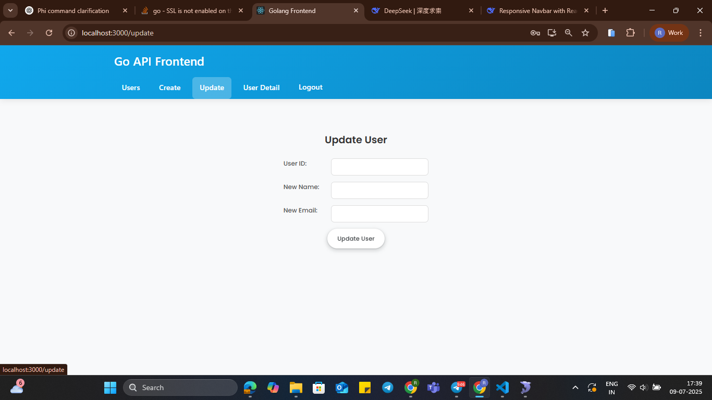
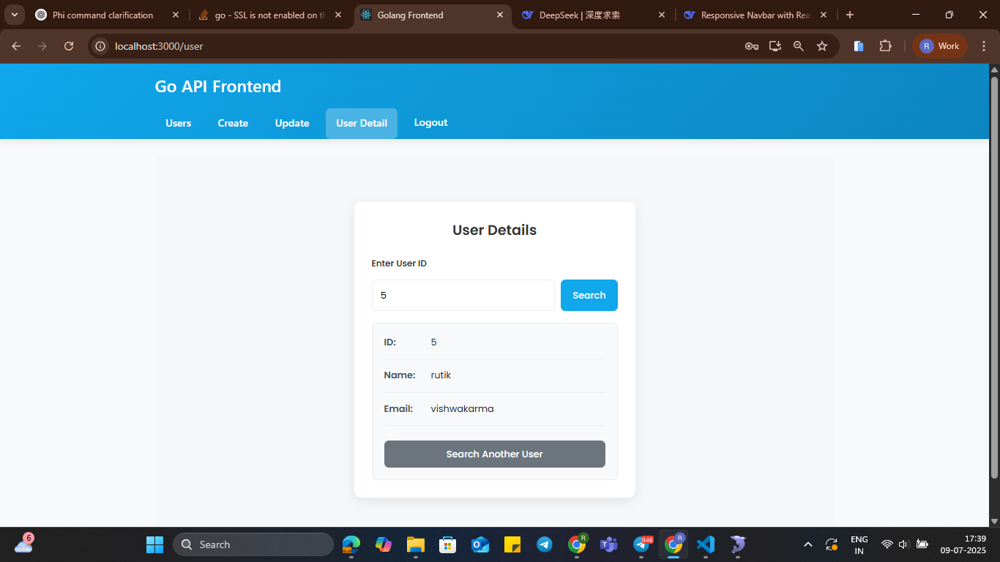
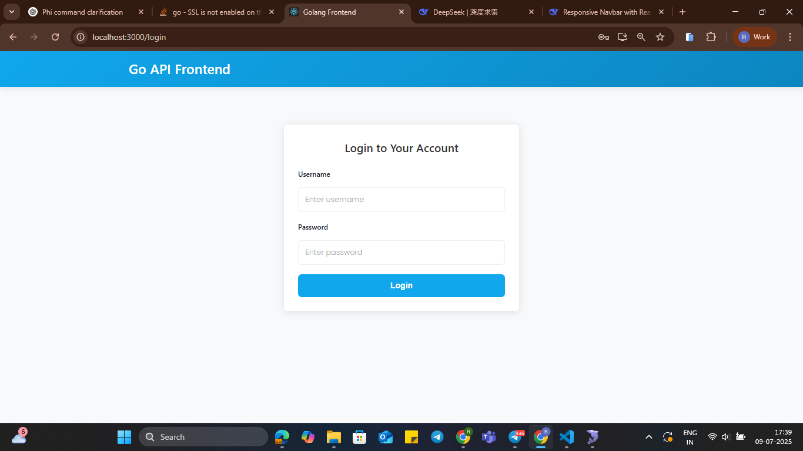
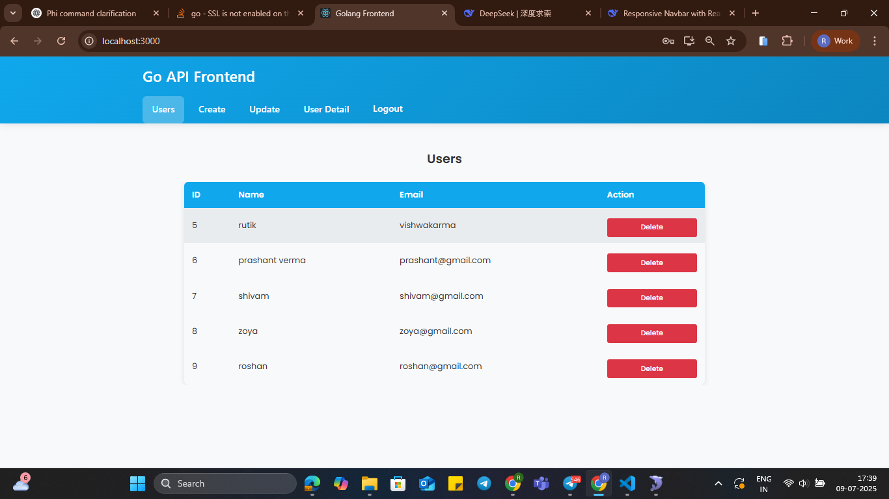
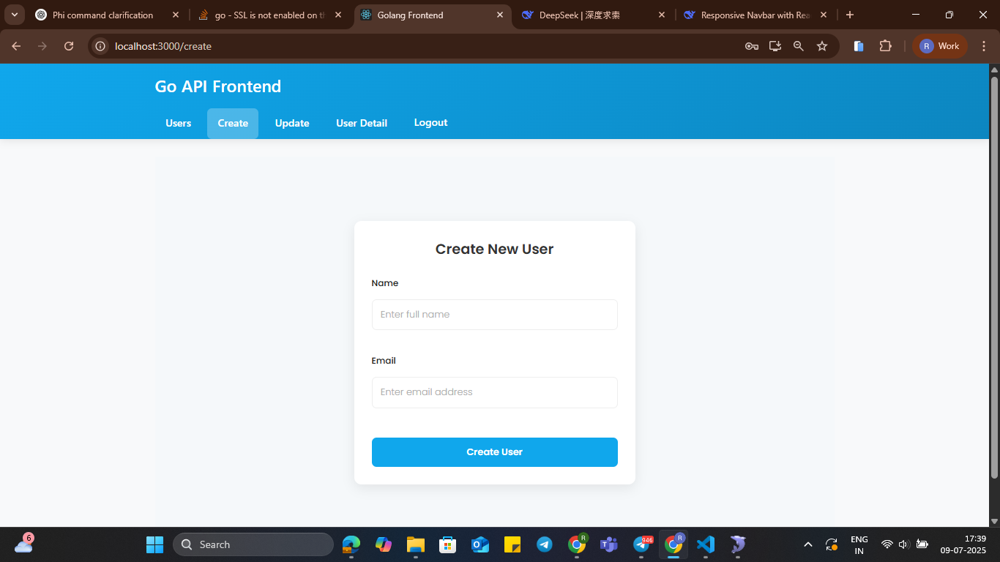

# ✅ GoLang + React ToDo Application

A full-stack ToDo list application built using **GoLang** (backend API) and **React** (frontend UI). This project demonstrates a simple yet effective CRUD system with modern tools and clean architecture.

---

## 🛠️ Tech Stack

### 🧩 Frontend (React)
- React 18 with functional components and hooks
- Tailwind CSS for responsive UI design
- Axios for API integration
- Toast notifications

### ⚙️ Backend (GoLang)
- GoLang with `net/http` for REST APIs
- Gorilla Mux for routing
- MySQL/PostgreSQL for database (can be swapped)
- GORM or database/sql for ORM

---

## 📸 Screenshots

### 🖼️ Homepage – Task List





*Shows list of tasks with status, edit, and delete actions.*


---

## 📁 Folder Structure

```
GoLang_React_ToDo/
├── client/              # React frontend
│   ├── src/
│   ├── public/
│   └── package.json
├── server/              # Go backend
│   ├── main.go
│   ├── handlers/
│   └── models/
├── assets/              # Screenshots and media
├── README.md
└── .env.example         # Environment config template
```

---

## 🚀 How to Run

### 🔹 Frontend (React)

```bash
cd client
npm install
npm start
```

### 🔹 Backend (GoLang)

```bash
cd server
go mod tidy
go run main.go
```

> Make sure your `.env` is configured with the correct DB credentials.

---

## 📃 License

MIT License